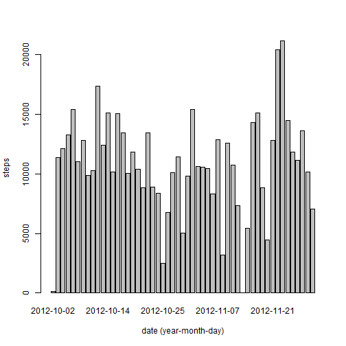
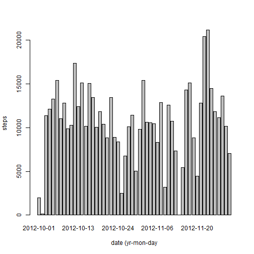
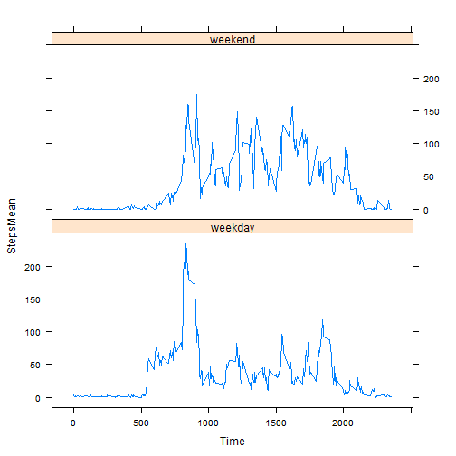

Title  R Markdown - Assignment 1 - Reproducible Research
========================================================

MBJ 7/13/14

## Assignment

From https://class.coursera.org/repdata-004/human_grading/view/courses/972143/assessments/3/submissions 

##Introduction

It is now possible to collect a large amount of data about personal movement using activity monitoring devices such as a Fitbit, Nike Fuelband, or Jawbone Up. These type of devices are part of the "quantified self" movement - a group of enthusiasts who take measurements about themselves regularly to improve their health, to find patterns in their behavior, or because they are tech geeks. But these data remain under-utilized both because the raw data are hard to obtain and there is a lack of statistical methods and software for processing and interpreting the data.

This assignment makes use of data from a personal activity monitoring device. This device collects data at 5 minute intervals through out the day. The data consists of two months of data from an anonymous individual collected during the months of October and November, 2012 and include the number of steps taken in 5 minute intervals each day.

##Data

The data for this assignment can be downloaded from the course web site:

Dataset: Activity monitoring data [52K]
The variables included in this dataset are:

steps: Number of steps taking in a 5-minute interval (missing values are coded as NA)

date: The date on which the measurement was taken in YYYY-MM-DD format

interval: Identifier for the 5-minute interval in which measurement was taken

The dataset is stored in a comma-separated-value (CSV) file and there are a total of 17,568 observations in this dataset.


##Preliminaries


```r
library(ggplot2)
library(lattice)
# setwd("C:/Users/mjaffe/Documents/CourseraandOpenEDx/DataScience(Hopkins)/ReproducibleResearch")
```

##Load data  

Loading and preprocessing the data
   Load the data (i.e. read.csv())
   Process/transform the data (if necessary) into a format suitable for your analysis

Also save a summary of the data (and find the number of NAs)


```r
activitydata <- read.csv("activity.csv", header=TRUE)
sumactivitystats     <- summary(activitydata)
nbrNAs       <- is.na(activitydata$steps)
```
## Summary statistics

```r
sumactivitystats
```

```
##      steps               date          interval   
##  Min.   :  0.0   2012-10-01:  288   Min.   :   0  
##  1st Qu.:  0.0   2012-10-02:  288   1st Qu.: 589  
##  Median :  0.0   2012-10-03:  288   Median :1178  
##  Mean   : 37.4   2012-10-04:  288   Mean   :1178  
##  3rd Qu.: 12.0   2012-10-05:  288   3rd Qu.:1766  
##  Max.   :806.0   2012-10-06:  288   Max.   :2355  
##  NA's   :2304    (Other)   :15840
```

## Determine number of steps for each date and plot
## and save original mean and median

What is mean total number of steps taken per day?

  For this part of the assignment, you can ignore the missing values in the    dataset.

   Make a histogram of the total number of steps taken each day

   Calculate and report the mean and median total number of steps taken per day


```r
stepsperdate <- aggregate(steps ~ date, data=activitydata, FUN=sum)
meansperdate <- aggregate(steps ~ date, data=activitydata, function(x) mean(x, na.rm=T))  # NA's removed
mean.original   <- mean(stepsperdate$steps)
median.original <- median(stepsperdate$steps)
```


```r
barplot(stepsperdate$steps, names.arg=stepsperdate$date, xlab="date (year-month-day)", ylab="steps")
```

 

The mean and median total number of steps taken per day are 1.0766 &times; 10<sup>4</sup>and  10765, respectively..

## Average daily activity pattern

   What is the average daily activity pattern?

   Make a time series plot (i.e. type = "l") of the 5-minute interval (x-axis)   and the average number of steps taken, averaged across all days (y-axis)

   Which 5-minute interval, on average across all the days in the dataset, contains the maximum number of steps?


```r
stepsperdate.interval <- aggregate(steps ~ interval, data=activitydata, FUN=mean)
max_interval <- stepsperdate.interval$interval[which.max(stepsperdate.interval$steps)]
```
As can be seen from the plot below, the 5-minute interval(across all days in dataset), with the maximum number of steps is the 835th interval.


```r
plot(stepsperdate.interval, type="l")
```

 

## Impute missing values 

Note that there are a number of days/intervals where there are missing values. The presence of missing days may introduce bias into some calculations or summaries of the data.

Calculate and report the total number of missing values in the dataset.

Devise a strategy for filling in all of the missing values in the dataset. The strategy does not need to be sophisticated. For example, you could use the mean/median for that day, or the mean for that 5-minute interval, etc.

Create a new dataset that is equal to the original dataset but with the missing data filled in.

Make a histogram of the total number of steps taken each day and Calculate and report the mean and median total number of steps taken per day. Do these values differ from the estimates from the first part of the assignment? What is the impact of imputing missing data on the estimates of the total daily number of steps?

## Strategy : Replace missing values with the  mean for day

The total number of missing 5 minute interval values are 2304.


```r
imputedactivitydata = activitydata
datecntr = 1
daymean_value = meansperdate[1]$steps
sizeactivity  = dim(imputedactivitydata)[1]
sizemeansteps = dim(meansperdate)[1]

for (i in 1:sizeactivity) {
  nextdate      = as.Date(imputedactivitydata[i,]$date)
  meanstepdate = as.Date(meansperdate$date[datecntr])

  # make sure mean value for "current date" being used   
  if (nextdate != meanstepdate & datecntr <= sizemeansteps) {        
        datecntr = datecntr  + 1       
        daymean_value = meansperdate$steps[datecntr]
  }
  
  # if NA present replace with current mean valeue
  if (is.na(imputedactivitydata[i,]$steps)) { 
        imputedactivitydata[i,]$steps = daymean_value
  }
}
```


```r
stepsperdateimputed <- aggregate(steps ~ date, data=imputedactivitydata, FUN=sum)
mean.imputed   <- mean(stepsperdateimputed$steps)
median.imputed <- median(stepsperdateimputed$steps)
```


```r
barplot(stepsperdateimputed$steps, names.arg=stepsperdateimputed$date, xlab="date (yr-mon-day", ylab="steps")
```

 

The updated mean and median number of steps using imputed values are 1.0603 &times; 10<sup>4</sup> and 1.0682 &times; 10<sup>4</sup>, respectively differing from the original mean and median by -162.6916  and -82.5, respectively .   


```r
percentdiff.mean  = 100.0*(mean.imputed-mean.original)/mean.original
percentdiff.median= 100.0*(median.imputed-median.original)/median.original
```
The percentage differences for the mean and median are -1.5111  and -0.7664, respectively.


## Differences in activity patterns between weekdays and weekends?

Are there differences in activity patterns between weekdays and weekends?

For this part the weekdays() function may be of some help here. Use the dataset with the filled-in missing values for this part.

Create a new factor variable in the dataset with two levels - "weekday" and "weekend" indicating whether a given date is a weekday or weekend day.

Make a panel plot containing a time series plot (i.e. type = "l") of the 5-minute interval (x-axis) and the average number of steps taken, averaged across all weekday days or weekend days (y-axis). The plot should look something like the following, which was creating using simulated data:


```r
imputedactivitydata$weekday = weekdays(as.Date(imputedactivitydata$date) ) 
weekendsindicator = (imputedactivitydata$weekday == 'Saturday' | imputedactivitydata$weekday == 'Sunday') 
imputedactivitydata$weekportion      = 'weekend'
imputedactivitydata[!weekendsindicator,]$weekportion = 'weekday'
imputedactivitydata$weekportion = as.factor(imputedactivitydata$weekportion)
```


```r
stepsweekportion = with(imputedactivitydata, aggregate(x=steps, by=list(interval, weekportion),FUN=function(x) mean(x, na.rm=T)))
names(stepsweekportion) = c("Time", "DuringWeekportion", "StepsMean")
xyplot(StepsMean ~ Time | DuringWeekportion, data=stepsweekportion, layout=c(1,2), type='l')
```

 

As can be observed from the plots (and as one might expect for the current sedentary lifestyle most live) , weekends tend (on average) to have a greater level of activity (based on the number of steps recorded). 
